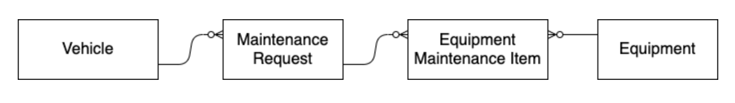

Apex Specialist Superbadge
---

## 📘 一、背景需求简述

**HowWeRoll Rentals** 是一家全球性的房车租赁公司，随着车队和客户规模快速增长，现有的 **维修与维护流程无法扩展**。公司希望通过 Salesforce 自动化日常维护工作，并与仓库管理系统进行集成，实现：

1. **自动生成日常维护请求**（Routine Maintenance）；
2. **与仓库系统同步设备库存和信息**；
3. **通过调度任务定期执行同步操作**；
4. **确保高可用性、可扩展性与测试完整性**。

---

## ⚙️ 二、主要功能与使用场景

| 功能           | 场景说明                                                                              |
| ------------ | --------------------------------------------------------------------------------- |
| **自动生成维护请求** | 当某个维修工单（Case）关闭时，若类型为 `Repair` 或 `Routine Maintenance`，系统应创建一个新的日常维护请求，以便进行下一轮保养。 |
| **计算下次维护时间** | 根据关联的设备（Equipment）的维护周期，系统自动设定下次维护的到期日（取最短周期）。                                    |
| **设备-维护关联**  | 每次维护请求中需记录使用了哪些设备（EquipmentMaintenanceItem），并为新请求新建记录。                            |
| **与仓库系统集成**  | Salesforce 向外部系统发起 REST 调用，获取库存和设备数据并进行同步更新。                                      |
| **每天自动同步库存** | 调度任务在每日凌晨 1:00 自动运行同步操作，确保 HQ 每天早上有最新数据。                                          |

---

## 🧱 三、对象设计概览（Object Model）

| 对象                               | 描述             | 关键字段                                                                                                            |
| -------------------------------- | -------------- | --------------------------------------------------------------------------------------------------------------- |
| `Case`（重命名为 Maintenance Request） | 表示维护请求         | `Type`, `Status`, `Vehicle__c`, `Subject`, `Report_Date__c`, `Due_Date__c`                                      |
| `Product2`（重命名为 Equipment）       | 维修和维护中使用的设备    | `Maintenance_Cycle__c`, `Lifespan_Months__c`, `Warehouse_SKU__c`, `Current_Inventory__c`, `Replacement_Part__c` |
| `Vehicle__c`                     | 房车车辆记录         | `Name`, `VIN__c`, 等                                                                                             |
| `Equipment_Maintenance_Item__c`  | 中间对象，连接设备与维护请求 | `Maintenance_Request__c`, `Equipment__c`                                                                        |


---

## 🧪 四、测试场景与清单

### ✅ A. 自动创建维护请求

| 测试项       | 内容                                                                   |
| --------- | -------------------------------------------------------------------- |
| 正常流程测试    | 创建一个类型为 `Repair` 的 Case，关闭后自动生成一个新的 `Routine Maintenance` 请求         |
| 多设备计算维护周期 | 请求中关联多个设备，系统取维护周期最短的设备进行 `Due Date` 计算                               |
| 无需触发测试    | Type 不是 `Repair` / `Routine Maintenance`，或 Status ≠ Closed 时，不应创建新请求 |
| 批量处理测试    | 批量插入并关闭 300 条记录，确保系统可以成功处理（无异常）                                      |
| 新旧数据隔离测试  | 新创建的 `EquipmentMaintenanceItem` 不应指向原始请求，应新建并关联新请求                   |

---

### ✅ B. 外部系统同步（REST Callout）

| 测试项     | 内容                                                                                                          |
| ------- | ----------------------------------------------------------------------------------------------------------- |
| 模拟返回值处理 | 使用 `HttpCalloutMock` 模拟 JSON 响应，验证字段正确解析并 upsert                                                            |
| 外部ID更新  | 使用 `Warehouse_SKU__c` 作为 External ID 更新已有 Equipment 数据                                                      |
| 字段映射正确性 | `Cost__c`, `Current_Inventory__c`, `Replacement_Part__c`, `Lifespan_Months__c`, `Maintenance_Cycle__c` 正确写入 |

---

### ✅ C. 调度任务测试（Scheduler）

| 测试项      | 内容                                                         |
| -------- | ---------------------------------------------------------- |
| 任务调度成功   | 使用 `System.schedule()` 触发调度类，并在 `Test.stopTest()` 后验证任务已排队 |
| 调用链执行无异常 | 调用调度任务 → 调用 Callout Service → 正常完成所有更新操作                   |

---

### ✅ D. 覆盖率与断言完整性

| 要求               | 说明                                                    |
| ---------------- | ----------------------------------------------------- |
| Apex 代码覆盖率达 100% | 所有 trigger、handler、service、scheduler、test 类必须 100% 覆盖 |
| 包含正负场景断言         | `System.assert()` 用于验证数据是否按预期生成或未生成                   |
| 异常处理测试           | 若 JSON 异常或无响应，应优雅失败，不抛出系统错误                           |

---

## 🧩 五、补充建议

* 所有类名、字段名请严格按照 Superbadge 要求命名；
* 不要硬编码 ID，使用动态查询或测试数据工厂；
* 调试时使用 `System.debug()` 逐步分析；
* 注意逻辑与触发条件的分离：Trigger → Helper → Service/Utility；
* 确保使用 @future/@testSetup/@isTest 关键字规范合理。

---


## 🔧 六、 操作验证步骤

---

### 🧾 **一、数据准备（只需操作一次）**

#### 1. 创建 Playground 或 Developer Org

进入 Trailhead，点击 Superbadge 页面 → 点击 “Launch” 创建新的 Playground。

#### 2. 安装 Superbadge Package

* 使用以下链接安装：
  `https://login.salesforce.com/packaging/installPackage.apexp?p0=04t6g000008av9iAAA`

#### 3. 更新字段与布局

* 给 **Case 对象的 Type 字段**添加 Picklist 值：

    * `Repair`
    * `Routine Maintenance`
* 将 **Case 页面布局**分配为：`Case (HowWeRoll) Layout`
* 将 **Product2 页面布局**分配为：`Product (HowWeRoll) Layout`
* 重命名标签：

    * Case → Maintenance Request
    * Product → Equipment

#### 4. 创建默认数据（系统样本）

* 打开 App Launcher → 搜索并打开 **How We Roll Maintenance** App
* 点击 **Create Default Data** 生成样本数据（Equipment、Vehicle、Case等）

---

### 🔁 **二、验证：自动创建维护请求**

#### ✅ 正面测试步骤

1. 打开任意一个已生成的 Maintenance Request（Case）：

    * Type: `Repair`
    * Status: `Closed`（如没有则编辑为 Closed）

2. 确认其关联了：

    * 至少一个 EquipmentMaintenanceItem
    * Equipment 和 Vehicle 已关联

3. 保存记录

4. 验证是否自动创建了一个新的 Maintenance Request：

    * Type: `Routine Maintenance`
    * Subject 不为空
    * Report Date = 今天
    * Due Date = 今天 + 最短设备维护周期
    * 新的 EquipmentMaintenanceItem 创建并指向新的 Request
5. 批量验证：

   * 使用匿名 Apex 在 Dev Console 或 VS Code 中插入 **300 个 Case 记录** 并关闭它们，然后检查是否成功批量创建了 300 个新 Maintenance Request。

```apex
List<Case> caseList = new List<Case>();
for (Integer i = 0; i < 300; i++) {
    caseList.add(new Case(
        Subject='Repair Job ' + i,
        Type='Repair',
        Status='Closed',
        Origin='Phone',
        Vehicle__c='a01XXXXXXXXXXXX', // 替换为有效的 Vehicle ID
        // 需要手动插入对应的 EquipmentMaintenanceItem
    ));
}
insert caseList;
```

#### ❌ 负面测试步骤

1. 创建一个 Type = `Other` 或 Status ≠ `Closed` 的 Case
2. 保存后确认 **没有** 生成新的 Maintenance Request

---

### 📦 **三、验证：REST 调用同步外部设备数据**

#### 使用 Apex 执行同步方法（模拟 callout）

```apex
System.enqueueJob(new WarehouseCalloutService());
```

#### 验证结果：

* 进入 Equipment（Product）列表
* 找到被更新/插入的记录（通过 Warehouse\_SKU\_\_c）
* 确认字段是否更新：

    * Cost
    * Current Inventory
    * Replacement Part = true
    * Lifespan
    * Maintenance Cycle

---

### ⏰ **四、验证：定时调度同步任务**

#### 手动调度一次任务验证（用 Schedule Apex）

```apex
String jobId = System.schedule(
    'Daily Sync',
    '0 0 1 * * ?', // 每天凌晨1点
    new WarehouseSyncSchedule() // 替换为你的类名
);
System.debug('Scheduled Job ID: ' + jobId);
```

#### 验证方式：

1. 查看 Setup → Scheduled Jobs，确认 Job 已排队；
2. 在开发控制台或 Setup > Apex Jobs 查看日志确认 `WarehouseCalloutService` 被调用；
3. 如果你使用了 Log 或 Debug，可以验证同步过程是否执行。

---

### 🧪 **五、验证：测试类执行与覆盖率**

#### 进入 Developer Console 或 Setup > Apex Test Execution：

1. 执行所有 Test Class；
2. 查看测试结果是否全部成功（No Failures）；
3. 进入 **Code Coverage** 标签页，确保所有相关类和 trigger 覆盖率为 **100%**：

| 类/触发器                        | 目标覆盖率       |
| ---------------------------- | ----------- |
| `MaintenanceRequest` Trigger | 100%        |
| `MaintenanceRequestHelper`   | 100%        |
| `WarehouseCalloutService`    | 100%        |
| `WarehouseSyncScheduler`     | 100%        |
| 所有 Test 类                    | Pass + 包含断言 |

---


